# 🚀 AI Code Mimic

<div align="center">

**一个基于 AI 的代码自动化生成工具**  
通过学习现有代码模板并结合 OpenAPI/Swagger 定义，快速仿写出高质量的业务代码

[](https://www.typescriptlang.org/)
[](https://react.dev/)
[](https://vitejs.dev/)
[](https://ant.design/)

</div>

---

## 📖 项目简介

**AI Code Mimic** 是一款面向前端开发者的智能代码生成助手。它能够深度分析你提供的代码模板，结合 Swagger/OpenAPI 接口定义，通过 Dify AI 智能体自动生成符合团队编码规范的业务代码。

### 🎯 核心价值

- ✅ **统一代码风格**: 确保团队成员输出的代码风格高度一致
- ✅ **减少重复劳动**: 避免为新接口手动编写相似的 CRUD 代码
- ✅ **降低错误率**: 基于 OpenAPI 定义生成类型安全的代码,减少接口对接错误
- ✅ **提升效率**: 从"数小时编写"到"数秒生成",大幅缩短开发周期

---

## ✨ 核心特性

### 🔍 Swagger 智能解析

- 支持上传 **OpenAPI 2.0/3.0** JSON 文件
- 自动提取 `path`、`method`、`summary`、`parameters`、`responses` 等元数据
- 提供可搜索、可多选的接口列表,自由选择生成范围

### 📝 模板驱动生成

- 集成 **Monaco Editor**,提供与 VS Code 一致的编辑体验
- 支持语法高亮、代码折叠、智能补全
- AI 深度学习用户提供的代码风格(命名规范、错误处理、依赖库使用方式)

### 🔄 差异化对比 (Diff View)

- 内置 **Monaco Diff Editor**,并排显示原始模板与生成代码
- 实时高亮差异行,支持逐行对比审查
- 一键复制生成结果到剪贴板

### 🕰️ 历史追溯

- 自动缓存每次生成记录(模板代码、选中接口、生成结果)
- 支持随时回溯查看历史版本
- 本地持久化存储,刷新页面不丢失

### ⚙️ Dify 工作流集成

- 灵活配置 **Dify Agent** 的 Base URL 和 API Key
- 支持自定义 System Prompt,调整生成策略
- 使用 Zustand 持久化存储配置,避免重复输入

---

## 🛠️ 技术栈

| 技术               | 版本 | 用途                         |
| ------------------ | ---- | ---------------------------- |
| **React**          | 19.2 | 前端框架                     |
| **TypeScript**     | 5.9  | 类型安全                     |
| **Vite**           | 7.2  | 构建工具                     |
| **Ant Design**     | 5.x  | UI 组件库                    |
| **Zustand**        | -    | 状态管理 (带 persist 中间件) |
| **Monaco Editor**  | -    | 代码编辑器                   |
| **Swagger Client** | -    | OpenAPI 解析                 |
| **pnpm**           | -    | 包管理工具                   |

---

## 🚦 快速开始

### 📋 环境要求

- **Node.js**: >= 18.0.0
- **pnpm**: >= 8.0.0 (推荐使用 pnpm)

### 📦 安装依赖

```bash
# 克隆项目
git clone https://github.com/your-username/ai-code-mimic.git
cd ai-code-mimic

# 安装依赖
pnpm install
```

### 🏃 启动开发服务器

```bash
pnpm run dev
```

浏览器访问: **http://localhost:5173**

### 🔧 配置 Dify

1. 点击右上角 **Settings** 按钮
2. 填写以下信息:
   - **Dify API Base URL**: 例如 `https://api.dify.ai/v1`
   - **API Key**: 从 Dify 控制台获取的 API 密钥
3. 点击 **Save & Verify** 保存配置

> 💡 **提示**: 配置会自动存储在 LocalStorage 中,下次打开无需重新输入。

---

## 📂 目录结构

```
src/
├── components/           # React 组件
│   ├── ConfigModal.tsx       # Dify 配置弹窗
│   ├── SwaggerSelector.tsx   # Swagger 接口选择器
│   ├── CodeEditorArea.tsx    # 代码模板编辑器
│   ├── DiffResultViewer.tsx  # 差异对比视图
│   └── HistoryList.tsx       # 历史记录侧边栏
├── store/                # Zustand 状态管理
│   └── useAppStore.ts        # 全局状态 (Config, Task, History)
├── services/             # API 服务层
│   └── difyService.ts        # Dify API 调用封装
├── utils/                # 工具函数
│   └── swaggerParser.ts      # Swagger JSON 解析器
├── App.tsx               # 主应用布局
└── main.tsx              # 应用入口
```

---

## 🤖 Dify 配置指南

### 1. 创建 Dify Workflow

登录 [Dify 控制台](https://cloud.dify.ai/),创建一个新的 **Completion** 或 **Chat** 类型的应用。

### 2. 配置 LLM 节点

将 `DIFY_PROMPT_TEMPLATE.md` 中的提示词粘贴到 **System Prompt** 区域。

### 3. 定义变量

在工作流中定义以下输入变量:

- `templateCode` (string): 用户提供的代码模板
- `apiContext` (string): 选中的 Swagger 接口定义 JSON

### 4. 获取 API Key

在应用设置中复制 **API Key** 和 **API Endpoint**,粘贴到本工具的 Settings 中。

---

## 📝 使用流程

```mermaid
graph LR
    A[上传 Swagger JSON] --> B[选择目标接口]
    B --> C[粘贴代码模板]
    C --> D[点击 Generate Code]
    D --> E[AI 分析并生成]
    E --> F[Diff 视图对比]
    F --> G[保存到历史记录]
```



### 详细步骤

1. **上传 Swagger 文件**: 点击左侧 "Upload Swagger JSON" 按钮,选择 OpenAPI 定义文件
2. **选择接口**: 在接口列表中勾选需要生成代码的 API
3. **输入模板**: 在中间编辑器粘贴现有的代码模板(如已有的 API 调用代码)
4. **生成代码**: 点击顶部 "Generate Code" 按钮
5. **审查结果**: 在右侧 Diff 编辑器中查看生成的代码,对比差异
6. **查看历史**: 左侧历史面板可随时恢复之前的生成记录

---

## 🎨 界面预览

<table>
  <tr>
    <td><strong>主界面</strong></td>
    <td><strong>配置弹窗</strong></td>
  </tr>
  <tr>
    <td></td>
    <td></td>
  </tr>
  <tr>
    <td><strong>Diff 对比</strong></td>
    <td><strong>历史记录</strong></td>
  </tr>
  <tr>
    <td></td>
    <td></td>
  </tr>
</table>

> 💡 **提示**: 将实际截图放在 `docs/images/` 目录下替换上述占位符。

---

## 🔨 构建与部署

### 构建生产版本

```bash
pnpm run build
```

生成的静态文件位于 `dist/` 目录,可部署到任意静态托管服务 (Vercel, Netlify, GitHub Pages)。

### 预览生产构建

```bash
pnpm run preview
```

---

## 🤝 贡献指南

欢迎贡献代码、提交 Issue 或提出改进建议!

1. Fork 本仓库
2. 创建特性分支: `git checkout -b feature/amazing-feature`
3. 提交更改: `git commit -m 'Add some amazing feature'`
4. 推送到分支: `git push origin feature/amazing-feature`
5. 提交 Pull Request

---

## 📄 许可证

本项目采用 **MIT License** 开源协议。详见 [LICENSE](LICENSE) 文件。

---

## 💬 联系方式

- **作者**: Your Name
- **邮箱**: your.email@example.com
- **GitHub**: [@your-username](https://github.com/your-username)
- **Issue Tracker**: [提交问题](https://github.com/your-username/ai-code-mimic/issues)

---

<div align="center">

**⭐ 如果这个项目对你有帮助,请给个 Star 支持一下! ⭐**

Made with ❤️ by [Your Name]

</div>
